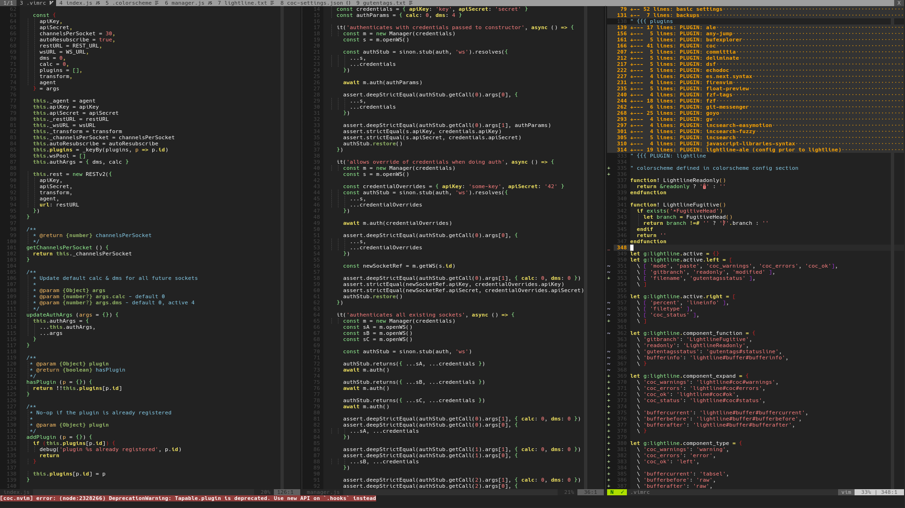

# f3rno's dotfiles

[![NPM Version][npm-image]][npm-url]
[![Build Status][travis-image]][travis-url]
[![Downloads Stats][npm-downloads]][npm-url]

> Deployed since *Thu Dec 25 20:03:34 2014 +0100*

Accumulated since 2012, from my [dwm][dwm-url] days and beyond
[awesome][awesomewm-url], now settled on a combination of [i3][i3-url],
[dunst][dunst-url], and [rofi][rofi-url] powered by [fzf][fzf-url] and the
classic [silver-searcher-ag][ag-url], then finally full-circle to a populated
[.bashrc](.bashrc) requiring a personal [xf-bash-lib](xf-bash-lib-url) to
operate sanely across a variety of environments.

## Setup

Since the beginning I've utilised the outdated [dotfiles][dotfiles-url] package
to deploy this configuration. As of this moment, *Fri Oct  8 05:50:45 PM UTC
2021*, it still clobbers existing directories. Hence a re-installation of local
*pip* packages is required after each sync. Regardless:

```bash
cd ~
pip install --user dotfiles

# This folder structure is used for the Github repo helpers, i.e. gc
mkdir -p ".src/github/$USER"
cd ".src/github/$USER"

git clone https://github.com/f3rno64/dotfiles.git

cd dotfiles

git submodule init
git submodule update
```

Edit the config at [dotfilesrc](dotfilesrc) to point to the cloned repo.
Example follows.

```rc
// ...
repository = /home/user/.dotfiles
// ...
```

Finally, sync and re-install your `pip` packages due to the subsequent clobber:

```bash
cp dotfilesrc ~/.dotfilesrc
dotfiles -f -s
pip install --user dotfiles
```

### Bash Utility Examples

Highly opinionated and plentiful, below are some examples:

```bash
# clones github.com/nvm-sh/nvm to ~/.src/github/nvm-sh/nvm
gc nvm-sh/nvm # clones https://github.com/nvm-sh/nvm.git into .src/github/nvm-sh/nvm

# Installs neovim using either apt, pkg (termux), or dnf
pkgi neovim

# ls -alhc
ll

# Uses unix pass to generate g/google, copies it, and clears the screen
pass-gen g/google
```

### VIM Eye Candy



### Dependencies

Since [xf-bash-lib][xf-bash-lib-url] only enables then features that have the
required dependencies present on the system, all the following are optional:

> NOTE: one may consider these bare essentials

* [sharkdp/bat][bat-url] -- `cat` with syntax highlighting and themes, bells,
    whistles, etc..
* [wting/autojump][autojump-url] -- a **fuzzy** `cd`
* [nvm-sh/nvm][nvm-url] -- node version manager
* [rvm/rvm][rvm-url] -- ruby version manager
* [junegunn/fzf][fzf-url] -- recursive CLI fuzzy file finder
* [zx2c4/password-store][pass-url] -- unix pass
  * [website][pass-web-url]
  * [upstream][pass-upstream-url]
* [i3/i3][i3-url] -- i3 tiling window manager
* [i3/i3lock][i3lock-url] -- minimalist lockscreen for i3
  * **NOTE:** a display manager **is** required, otherwise one can bypass
        **i3lock** by switching to a different tty. [gdm][gdm-url] is an option.
* [dunst-project/dunst][dunst-url] -- minimalist desktop growl notification
* [davatorium/rofi][rofi-url] -- multi-purpose graphical list selector (i.e.
    can render results from fzf and pipe your selection onwards)

---

## Notes

### Virtual Console Fonts

Fonts are available in `/usr/lib/kbd/consolefonts` and need to be set in
`/etc/vconsole.conf`. To use `terminus`, install the console terminus font for
the running distro (`terminus-fonts-console` for fedora) and set it in
`/etc/vcovconsole.conf`.

To test, use `setfont`:
`setfont -h12 /usr/lib/kbd/consolefonts/ter-u12n.psf.gz`.

> Example final vconsole.conf

```conf
KEYMAP="us"
FONT="ter-u12n.psf.gz"
```

### License

Distributed under the **MIT** license. See [LICENSE.md](/LICENSE.md) for more
information.

[bat-url]: https://github.com/sharkdp/bat
[autojump-url]: https:/github.com/wting/autojump
[nvm-url]: https://github.com/nvm-sh/nvm
[rvm-url]: https//github.com/rvm/rvm
[fzf-url]: https://github.com/junegunn/fzf
[pass-url]: https://github.com/zx2c4/password-store
[pass-web-url]: https://www.passwordstore.org/
[pass-upstream-url]: https://git.zx2c4.com/password-store
[i3-url]: https://github.com/i3/i3
[i3lock-url]: https://github.com/i3/i3lock
[gdm-url]: https://github.com/GNOME/gdm
[dunst-url]: https://gihtub.com/dunst-project/dunst
[rofi-url]: https://github.com/davatorium/rofi
[awesomewm-url]: https://github.com/awesomeWM/awesome
[dwm-url]: https://git.suckless.org/dwm
[ag-url]: https://github.com/ggreer/the_silver_searcher
[xf-bash-lib-url]: https://github.com/f3rno64/xf-bash-lib
[dotfiles-url]: https://github.com/jbernard/dotfiles

[npm-image]: https://img.shields.io/npm/v/@f3rno64/dotfiles.svg?style=flat-square
[npm-url]: https://npmjs.org/package/@f3rno64/dotfiles
[npm-downloads]: https://img.shields.io/npm/dm/@f3rno64/dotfiles.svg?style=flat-square
[travis-image]: https://img.shields.io/travis/f3rno64/dotfiles/master.svg?style=flat-square
[travis-url]: https://travis-ci.org/f3rno64/dotfiles
